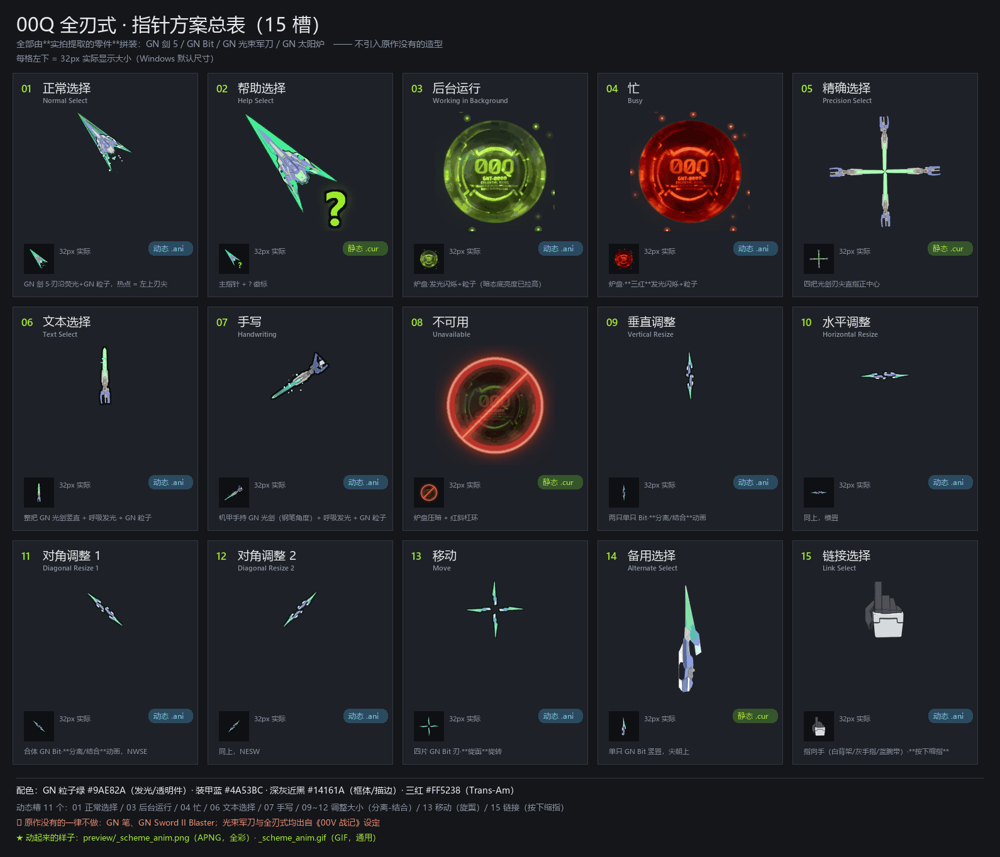

# 00Q 全刃式 · Windows 指针套装 + 打包工具链

用 **00Q 全刃式（00Qan[T] Full Saber）** 的实拍零件拼出来的一整套 Windows 鼠标指针，
**外加**把它做出来用的那套工具链（`cursorforge`）。

> 同人作品，非商业。高达 / 00 Qan[T] / GN 太阳炉 等名称与设定版权归
> **创通·サンライズ / バンダイ**。本仓库与权利人无隶属关系。

---

## 只想装上用？下载 Release 就行

到 **[Releases](https://github.com/lorinatsureborn/gundam-cursor-00Q-full-saber/releases/latest)**
下载 **`GUNDAM-00Q-Cursors-v1.0.zip`**：

1. 解压（别在压缩包预览窗口里直接双击）
2. 右键 `install.ps1` → **使用 PowerShell 运行**
3. 权限提示点「是」 → 立即生效，不用重启

包里带了预览图和一份**面向普通用户**的安装说明。
⚠️ 若提示「无法加载文件，因为在此系统上禁止运行脚本」——
这是下载文件的安全锁：右键 `install.ps1` → 属性 → 勾选**「解除锁定」**，再运行。

---



↑ **动画总表** —— 15 格全部动起来，一眼看完 11 个动态槽。
全彩版（**APNG**，推荐）在 [`preview/_scheme_anim.png`](preview/_scheme_anim.png)；
上面这张 GIF 是给"只认 GIF 的工具"的兜底，发光渐变会被压成色带（256 色限制）。

静态总表：[`preview/_scheme.png`](preview/_scheme.png) ·
单个动效：`preview/ani_*.gif`（15 个）·
浏览器里看全部：[`preview/preview.html`](preview/preview.html)

---

## 一、装指针

下载后右键 **`cursors/install.ps1`** → *使用 PowerShell 运行*
（会提权，**装完立即生效，不用注销**）。

之后可在 `设置 → 蓝牙和其他设备 → 鼠标 → 其他鼠标设置 → 指针` 里切回默认。
卸载：右键 `cursors/uninstall.ps1`。

**15 个槽位，11 动 / 4 静：**

| 槽 | 造型 | | 槽 | 造型 |
|---|---|---|---|---|
| 01 正常选择 | GN 剑 5（热点 = 刃尖）· 呼吸发光 + 粒子 | **动** | 09 垂直调整 | 两只 GN Bit · **分离/结合** | **动** |
| 02 帮助选择 | 主指针 + GN 绿 `?` | 静 | 10 水平调整 | 同上，横置 | **动** |
| 03 后台运行 | 炉盘 · 发光闪烁 + 粒子 | **动** | 11 对角调整 1 | 同上，NWSE | **动** |
| 04 忙 | 炉盘 · **三红**（Trans-Am）+ 粒子 | **动** | 12 对角调整 2 | 同上，NESW | **动** |
| 05 精确选择 | 四把光剑刃尖直指中心 | 静 | 13 移动 | 四片 Bit 刃 · **旋翼旋转** | **动** |
| 06 文本选择 | GN 光束军刀竖置（I 型）+ 粒子 | **动** | 14 备用选择 | 单只 Bit 竖直 | 静 |
| 07 手写 | 机甲手持 GN 光剑（**钢笔角度**） | **动** | 15 链接选择 | 指向手（实拍派生）· **按下缩指** | **动** |
| 08 不可用 | 暗态炉盘 + 红色 **LED 禁止环** | 静 | | | |

动效见 `preview/ani_*.gif`；成品按 32/48/64/96/128 档的 1:1 复验见 `preview/_review_light.png`。

---

## 二、用工具链

`cursorforge` 是**独立可用**的：给它一组 PNG，它给你 `.cur` / `.ani` + 安装脚本。
只依赖 **Pillow + numpy**，不需要 Windows SDK、不需要编译器。

```bash
pip install -r requirements.txt
python tests/selftest.py                                   # 16 项自测（含 LoadCursorFromFile）
python examples/minimal/make_art.py                        # 造几何图形当素材
python -m cursorforge build examples/minimal/spec.json     # 打包
python -m cursorforge verify examples/minimal/out          # 复验
```

### `spec.json`

```json
{
  "out": "out", "scheme_name": "MY-CURSORS", "reg_dir": "MYCURSORS",
  "sizes": [256, 128, 96, 64, 48, 32],
  "slots": [
    { "role": "arrow", "file": "my_arrow.cur", "master": "art/arrow.png",
      "hotspot": "ul" },
    { "role": "working", "file": "my_work.ani", "frames": "art/work/*.png",
      "hotspot": "c", "jiffy": 4, "sizes": [96, 64, 48, 32] }
  ]
}
```

* `role` 取 `Arrow` / `Wait` / `Crosshair` / `IBeam` / `NWPen` / `No` /
  `SizeNS` / `SizeWE` / `SizeNWSE` / `SizeNESW` / `SizeAll` / `UpArrow` /
  `Hand` / `Pin` / `Person`。**没提供的槽位自动复用最接近的那个** ——
  只做 3 个造型也能装（Windows 方案值要 17 项，少一项就装不上）。
* `hotspot`：`c`（正中）/ `ul`（左上尖）/ `ll`（左下尖）/
  `top`（最上一行中点，手型用）/ `"12,3"`。
* `jiffy`：**1 = 1/60 s**，`4` = 15 fps。
  ⚠️ **想让动画变慢请加帧数，不要加大 jiffy** —— 16 帧 × jiffy 8 = 7.5 fps，
  肉眼可见地一顿一顿。

### 当库用

```python
from cursorforge import static_tiers, hotspot, cur_with_hotspot, ani_bytes
from PIL import Image

master = Image.open("arrow.png").convert("RGBA")
tiers  = static_tiers(master, [256, 128, 96, 64, 48, 32])   # 逐档描边
hot    = hotspot(tiers[0], "ul")
open("arrow.cur", "wb").write(cur_with_hotspot(tiers, hot, 256))

frames = []
for im in my_frames:                       # 每帧一张母版
    ts = static_tiers(im, [96, 64, 48, 32])
    frames.append(cur_with_hotspot(ts, (48, 48), 96))
open("work.ani", "wb").write(ani_bytes(frames, jiffy=4))
```

---

## 三、这个工具链真正解决的三件事

格式本身不难，难的是三个**反复踩、且失败时往往不报错**的点。
它们都被写进了 API：

### ① `.cur` 的热点藏在最意想不到的字段里

`.cur` 就是 ICO —— 唯一的区别是热点 X/Y 塞在 `ICONDIRENTRY` 的
**`wPlanes` / `wBitCount`** 里（`.ico` 那里本该是 1 / 32）。

```python
# cursorforge/cur.py
entries += struct.pack("<BBBBHHII", w % 256, h % 256, 0, 0, hx, hy, ...)
#                                        ↑bReserved  ↑wPlanes ↑wBitCount
```

### ② `.ani` 的每一帧是**一个完整的、含全部档位的 `.cur`**

不是"每帧一张 32px 图"。所以 5 档 × 32 帧 = **160 张位图**，
于是撞上那个**不报错的硬墙**：

```
每个 icon 块上限 ~66 KB         ← 超了不报错，只是加载不出
.ani 体积 ≈ 帧数 × 档数 × 单块大小
```

★ **档位用 PNG 存就几乎不花钱。** BMP 是无压缩的（96px 一档 38 KB），
PNG 省 67~86% —— `[128,96,64,48,32]` 全 PNG **只要 15.7 KB**。
本仓库的 15 个指针实测：改 PNG 前 21.5 MB，改后 **7.2 MB**，
而且档位从 4 档升到 **5 档（多了 128px）**。

⚠️ 已用 `LoadImage` 指定尺寸取回 + GDI+ 渲染 + 与源图**逐像素比对**验证过：
Windows **确实会使用 PNG 档**，不是"能加载但画不出"。

`ani_bytes()` 会**主动检查并抛异常**，而不是给你一个装不上的文件。

### ③ ★ 一切以像素计的尺寸，必须在**该档自己的分辨率**上算

这条在本项目里被踩了 **6 次**，是最贵的一课：

| 做法 | 后果 |
|---|---|
| 512 母版上画 6px 描边 → 缩到 32px | 只剩 0.38px，被 LANCZOS 一平均 = **灰雾** |
| 512 母版上 3px 的粒子 → 缩到 32px | 只剩 0.19px，**直接消失** |
| 4× 超采样画布上 2px 的刻线 → 缩回 1× | 只剩 **0.5px**，糊没 |

**API 把这件事变成默认行为**：`static_tiers()` 先缩到该档，**再按该档的像素描边**。

---

## 四、素材是怎么来的

从 **11 张手机实拍**（模型零件 / 胸像 / 手）到 15 个成品指针，走的是：

```
验文件头 → 裁切 → BiRefNet 抠图 → PCA 摆正 → Qwen-Image-Edit 洗成平涂
→ 反推 alpha + 描边 → 色调校正 → 拼装 → 逐档生成 → 打包 → 从容器读回复验
```

完整方法论在 **`docs/ASSET-PIPELINE.md`**（七步管线 + **八条跨项目规律**），
格式细节在 **`docs/CURSOR-FORMAT.md`**。里面的每一条都是**踩过之后量出来的**。

### 几个反直觉的实测结论

* **斜置 45° 并不能多塞多少** —— 包围盒是 `(L+W)/√2`，
  3.6:1 的长条斜置只比竖直多 **12%**（只有零宽度长条才是 41%）。
* **旋转动画有车轮效应上限** —— 4 重对称的形状每帧转角 ≥ 45° 就会看成静止。
  实测「转 4 圈 / 32 帧」取样的 6 帧**完全一样，等于没转**；上限是 22.5°/帧。
* **"对接处必然收窄"这种几何直觉也可能是错的** —— 实测那个零件对接处的
  横截面**反而最宽**，"找腰部"的启发式挑到了完全错误的位置。
* **颜色距离判据会静默失效** —— 主体里的深灰件（V≈85）和背景（V≈68）只差 16 时，
  "与背景色的距离"会把**整块主体当背景抹掉**。改用从画面边界泛洪（结构判据）才对。
* **否定式断言在裁剪/越界 bug 下恒为真** ——
  "零重叠 / 零报错"这类检查在形状被裁到画布外时**依然通过**。
  要先验一个**肯定的事实**。

---

## 五、目录

```
cursors/          15 个成品 .cur/.ani + .inf + 安装/卸载脚本
preview/          总表、1:1 复验图、15 个动效 GIF、制作过程图
cursorforge/      ★ 可复用工具链
  cur.py            .cur 读写（热点、PNG/BMP 双轨、BMP 方向与通道）
  ani.py            .ani 读写 + icon 块上限检查
  tiers.py          多档位纪律：逐档缩放、逐档描边、热点
  scheme.py         .inf + install.ps1 / uninstall.ps1
  build.py          规格驱动的 CLI
tests/selftest.py   16 项自测（含 LoadCursorFromFile）
examples/minimal/   自包含最小示例
docs/
  CURSOR-FORMAT.md      格式细节 + 常见坑
  ASSET-PIPELINE.md     ★ 实拍/网图 → 平涂素材 的七步管线 + 八条跨项目规律
```

**不含**原始实拍照片与原作参考图（那些是私人素材，且涉及第三方版权）。
因此 `cursors/` 是可安装的成品，但**从照片重建的完整链条不可复现** ——
工具链本身（`cursorforge` + `tests` + `examples`）是**完全自包含可跑**的。

---

## License

代码：**MIT**（见 `LICENSE`）。
`examples/` 里的几何图形由程序生成，随 MIT 一起用。

同人指针作品：仅供个人使用，请勿商用。
高达 / 00 Qan[T] 全刃式 / GN 太阳炉 等名称与设定版权归
**创通·サンライズ / バンダイ**。
